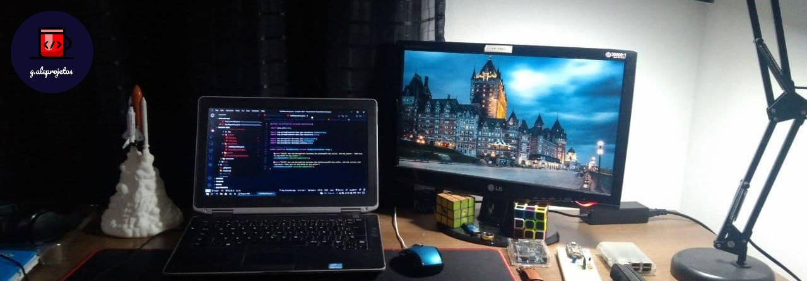
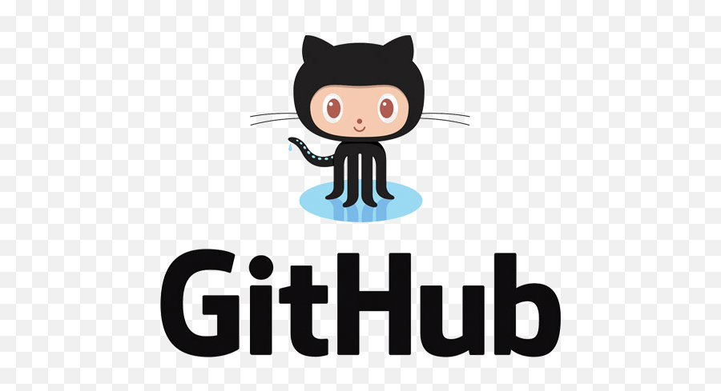

  

### Hello, I'm Alexandre, welcome to my portfolio.

<h3 align="left">Programming Languages</h3>

 &nbsp
  <a href="https://www.java.com" target="_blank"> &nbsp&nbsp </a>
   

<!--
<b>GitHub</b>
&nbsp&nbsp&#013-->

   

<h3 align="left">Frontend Development</h3>

 &nbsp &nbsp 
  &nbsp&nbsp 
   

<h3 align="left">Backend Development and Framework</h3>

  &nbsp&nbsp 
   

<h3 align="left">Mobile App Development</h3>

  

<h3 align="left">Database</h3>

  &nbsp&nbsp 
   &nbsp&nbsp
  

<h3 align="left">Other</h3>

 &nbsp&nbsp 
   

#### 🔗 Connect with me on :

#### 👀 visitor count

⭐ From [Alexandre Gonçalves](https://github.com/g-aleprojetos)

<!--
**g-aleprojetos/g-aleprojetos** is a ✨ _special_ ✨ repository because its `README.md` (this file) appears on your GitHub profile.

Here are some ideas to get you started:

- 🔭 I’m currently working on ...
- 🌱 I’m currently learning ...
- 👯 I’m looking to collaborate on ...
- 🤔 I’m looking for help with ...
- 💬 Ask me about ...
- 📫 How to reach me: ...
- 😄 Pronouns: ...
- ⚡ Fun fact: ...
-->
